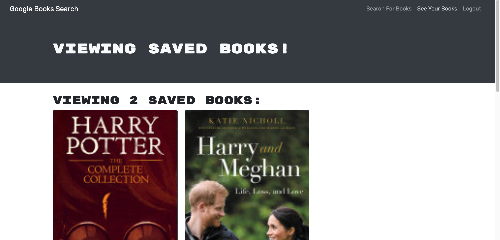

# book-engine
This challenge asked us to reconfigure a working application using GraphQL.
## Description
This book searching application relied on REST APIs to function previously. We were tasked with swapping out the REST APIs for GraphQL queries and mutations. 

## Additional Information
### Notes
This was a difficult challenge, I realized during the challenge how much consistency in variable naming and strict or non-strict was from the backend to the front end. If those differ you'll find errors. 

### Screenshot

### Access Application

* https://github.com/IsiBee/book-engine/ - Github Repo
* https://shielded-brook-79729.herokuapp.com/ - Deployed App